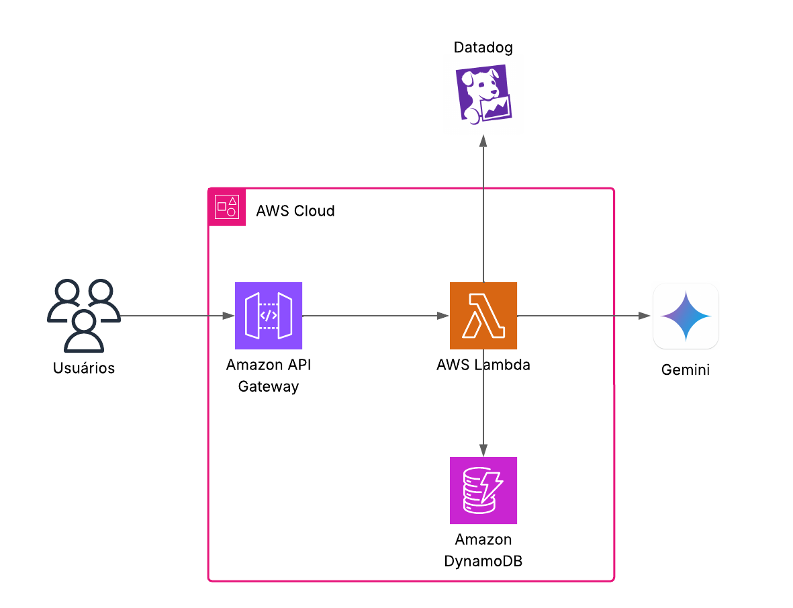

# Micro-serviço de Chat com LLM
Este projeto implementa um micro-serviço robusto para interagir com Large Language Models (LLMs), persistindo as interações em um banco de dados para análises futuras. O serviço foi projetado com foco em qualidade, segurança, resiliência e performance.

## Funcionalidades
- Recebimento de Prompts: Aceita requisições HTTP POST contendo prompts de usuários.
- Persistência de Dados: Armazena informações do prompt e da resposta da LLM em um banco de dados (MongoDB) para futuras análises operacionais.
- Integração com LLM: Envia o prompt recebido para uma LLM (como Gemini ou OpenRouter) e processa a resposta.
- Retorno Estruturado: Devolve a resposta da LLM ao usuário em um formato JSON estruturado, incluindo metadados relevantes.
- Flexibilidade de API: O design da API permite futuras alterações nos payloads de requisição e resposta para uma solução ideal e sustentável.

## Endpoint
O micro-serviço expõe um endpoint principal para interações de chat:

POST /v1/chat
Este endpoint permite que os usuários enviem prompts para a LLM e recebam as respostas.

Payload de Entrada (Exemplo):
```
{
  "userId": "12345",
  "prompt": "Como está a cotação do dólar hoje?"
}
```
Retorno Esperado (Exemplo):
```
{
  "id": "abcde-12345",
  "userId": "12345",
  "prompt": "Como está a cotação do dólar hoje?",
  "response": "A cotação do dólar hoje é R$5,10.",
  "model": "gemini-2.0-flash",
  "timestamp": "2024-06-15T14:32:00Z"
}
```
## Tecnologias Utilizadas
- Linguagem de Programação: Python
- Gerenciamento de Dependências: Poetry
- Banco de Dados: MongoDB (via Docker Compose)
- Large Language Models (LLMs): Google Gemini 

## Como Rodar Localmente
Siga os passos abaixo para configurar e executar o projeto em seu ambiente local.

Pré-requisitos
- Python 3.x
- Poetry
- Docker e Docker Compose

### Configuração
Clone o repositório:
```
git clone [https://github.com/liarqueiroz/llm-api.git](https://github.com/liarqueiroz/llm-api.git)
cd llm-api
```
Instale as dependências com Poetry:
```
poetry install
```
Configure as variáveis de ambiente:
Crie um arquivo .env na raiz do projeto e adicione sua chave de API da Gemini (ou OpenRouter):
```
GEMINI_API_KEY="SUA_CHAVE_API_AQUI"
```

Inicie o Banco de Dados MongoDB com Docker Compose:
O arquivo docker-compose.yaml na raiz do projeto define o serviço MongoDB.
```
docker compose up -d
```
Este comando iniciará o contêiner do MongoDB em segundo plano.

Execução
Para iniciar o micro-serviço, execute o seguinte comando na raiz do projeto:
```
poetry run python -m src.main
```
O serviço estará disponível em http://localhost:8080.

## Possível arquitetura

### Desenho de Arquitetura


Um desenho de arquitetura está incluído neste repositório, em um diretório docs/architecture. Este diagrama ilustra uma possível arquitetura para o micro-serviço na AWS, bem como suas interações com a LLM e o banco de dados, e envia dados pra uma plataforma de observabilidade.

Em termos de escalabilidade, os recursos escolhidos - AWS Lambda, AWS API Gateway - escalam de maneira automática dependendo da carga. Se a latência for um problema, podemos desacoplar a persistência dos dados da requisição e usar uma fila para que os dados sejam processados e salvos em um momento posterior. 

### Justificativa para o Uso do MongoDB
O MongoDB foi escolhido para este projeto como um banco de dados operacional devido à sua flexibilidade e capacidade de armazenar dados semi-estruturados (documentos JSON), o que é ideal para registrar as interações de chat com LLMs de forma rápida e eficiente.

Embora um banco de dados relacional (SQL) como PostgreSQL ou MySQL fosse mais adequado para análises complexas e relatórios (devido à sua estrutura rígida e otimização para consultas analíticas), o MongoDB atende perfeitamente aos requisitos de persistência de dados transacionais e operacionais deste micro-serviço, permitindo um rápido armazenamento e recuperação de cada interação. Para futuras análises de negócios mais aprofundadas, os dados poderiam ser movidos para um data warehouse baseado em SQL.

Optei por MongoDB na implementação por sua familiaridade e facilidade de desenvolvimento local. No desenho da arquitetura, usei DynamoDB por ser a solução gerenciada e nativa da AWS com características similares, como modelo de documentos, alta disponibilidade e escalabilidade automática.

### Observabilidade
Para observabilidade escolhi o DataDog, uma plataforma que coleta de logs, métricas, criação de alertas, e tracing distribuído.

### Falhas de Dependências
Caso a chamada para o LLM falhe, podemos implementar um retry com backoff ou ainda ter um segundo LLM que pode ser usado caso o primeiro falhe.

Caso a chamada para o banco de dados falhe, além de um retry, podemos criar uma fila para que os dados sejam processados em um momento posterior.

### Melhorias Futuras
Considerando os pilares de qualidade, segurança, resiliência e performance, as seguintes melhorias podem ser exploradas:

- Implementação de testes de integração e end-to-end robustos.
- Monitoramento de logs e métricas de qualidade das respostas da LLM usando Datadog
- Validação de esquemas de entrada e saída mais rigorosa.
- Autenticação e autorização de requisições (e.g., JWT, OAuth2).
- Implementação de retries com backoff exponencial para chamadas à LLM.
- Implementação de um segundo LLM como fallback.
- Implementação de uma fila para persistencia dos dados em momento posterior
- Estratégias de deploy multi-AZ/região para alta disponibilidade.


## Licença
Este projeto está licenciado sob a licença MIT. Veja o arquivo LICENSE para mais detalhes.